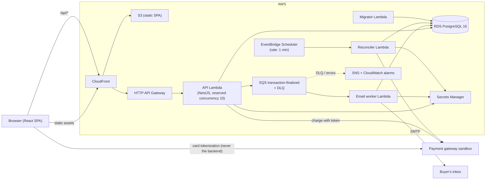
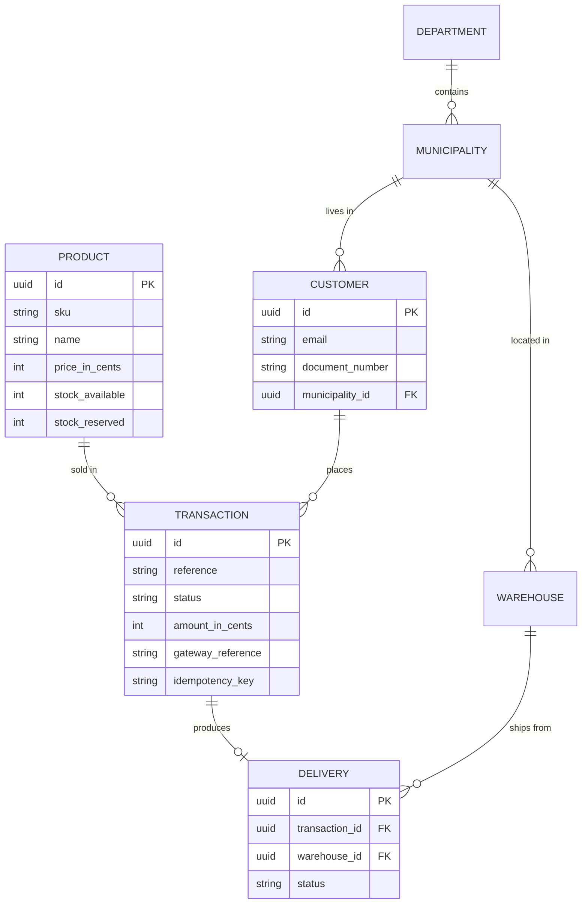

# SoundHub — headphones checkout

[](https://github.com/alesmo30/soundhub-checkout/actions/workflows/ci.yml)


SoundHub is a single-product checkout for headphones, paid by credit card through a
payment gateway's sandbox. A buyer opens a product, enters card and delivery details,
reviews a server-computed summary, pays, and lands on a final status screen with the
stock already updated. The backend is a NestJS API built with hexagonal architecture and
Railway Oriented Programming; the frontend is a React SPA with Redux Toolkit; both are
deployed on AWS with CDK. Card numbers and CVCs never reach the backend — the browser
tokenizes them against the gateway and only `{ token, brand, last4 }` travels on.

> **Live**
> · **App:** https://d2dponv42xzzpw.cloudfront.net
> · **API docs (Swagger):** https://d2dponv42xzzpw.cloudfront.net/api/docs
> · **Health:** https://d2dponv42xzzpw.cloudfront.net/api/v1/health

---

## Table of contents

- [Features](#features)
- [Quickstart](#quickstart)
- [Tech stack](#tech-stack)
- [Architecture](#architecture)
- [Data model](#data-model)
- [Project structure](#project-structure)
- [API](#api)
- [Seed data and test cards](#seed-data-and-test-cards)
- [Configuration](#configuration)
- [Development and testing](#development-and-testing)
- [Deploy and destroy](#deploy-and-destroy)
- [CI](#ci)
- [Design decisions](#design-decisions)
- [Rubric map](#rubric-map)
- [Further reading](#further-reading)
- [Known limitations](#known-limitations)

---

## Features

- **Five-screen checkout**: product → card and delivery details → summary → final status →
  back to the product with the stock updated.
- **Browser-side tokenization**: the card number and CVC go straight from the browser to
  the payment gateway. The backend only ever sees a token, the brand and the last four digits.
- **Server-computed amounts**: subtotal, base fee and delivery fee are always computed on
  the server, in integer cents. The client never sends a price.
- **Stock reservation**: stock is reserved inside the transaction that creates the payment,
  then confirmed or released when the gateway resolves — so two concurrent buyers cannot
  oversell the last unit.
- **Idempotent payments**: retrying the same payment (same idempotency key) returns the
  original transaction instead of charging twice.
- **Asynchronous result emails**: a finalized transaction publishes to SQS; a worker Lambda
  sends the buyer an approved/declined email, with a dead-letter queue and CloudWatch alarms.
- **Reconciler**: a scheduled Lambda resolves transactions the gateway confirmed late,
  every minute, so a slow sandbox never leaves an order stuck in `PENDING`.
- **Delivery fee rules**: free delivery over a threshold, flat fee otherwise, by municipality.
- **Responsive and accessible**: mobile-first Tailwind, verified at 375×667 and 1440×900,
  Lighthouse accessibility 100.
- **Hardened headers**: CSP, HSTS, `X-Frame-Options`, `Referrer-Policy` and COOP at the CDN
  edge — Mozilla Observatory grade **A+**.

## Quickstart

**Prerequisites:** Node 22, pnpm 10, Docker (for local PostgreSQL 16).

```bash
pnpm install                                    # install all workspaces
cp .env.example .env                            # then fill in the gateway sandbox keys
docker compose up -d postgres                   # local PostgreSQL 16
pnpm --filter @checkout/api migration:run       # apply migrations
pnpm --filter @checkout/api seed                # municipalities, warehouses, products
pnpm --filter @checkout/api start:dev           # API on :3000 (watch mode)
pnpm --filter @checkout/web dev                 # SPA on :5173, in a second terminal
```

Verify the API is up and serving the catalog:

```bash
curl http://localhost:3000/api/v1/products
```

Then open http://localhost:5173 and buy a pair of headphones with the
[test cards](#seed-data-and-test-cards) below.

## Tech stack

| Layer | Choice |
| --- | --- |
| API | NestJS 12, TypeScript 5.9, hexagonal architecture, Railway Oriented Programming (`Result`) |
| Persistence | PostgreSQL 16, TypeORM (migrations only, `synchronize` always off) |
| Web | React 19, Vite 8, Redux Toolkit 2, React Router, Tailwind CSS 4 |
| Shared | `packages/shared` — types and money helpers used by both apps |
| Infrastructure | AWS CDK 2 (TypeScript): CloudFront + S3, HTTP API + Lambda, RDS PostgreSQL, SQS, EventBridge Scheduler, SNS, Secrets Manager |
| Testing | Jest (api, shared, infra), Vitest + Testing Library (web), Playwright (pending) |
| Tooling | pnpm workspaces, ESLint + Prettier, GitHub Actions |

## Architecture



| Component | Responsibility | Never does |
| --- | --- | --- |
| React SPA | Collects card and delivery data, tokenizes the card with the gateway, renders server-computed amounts | Never computes a price, never sends a raw card number anywhere but the gateway |
| API Lambda | Quotes, customers, transactions, stock reservation, finalization | Never stores a card number or CVC, never trusts a client-sent amount |
| Migrator Lambda | Runs TypeORM migrations on deploy | Never serves traffic |
| Email worker | Consumes `transaction-finalized`, sends the result email over SMTP | Never changes transaction state |
| Reconciler | Every minute, resolves transactions the gateway confirmed late | Never charges a card |
| RDS PostgreSQL | System of record, integer-cent amounts | Never reachable from the public internet |
| Secrets Manager | Gateway private key, integrity/events secrets, SMTP credentials | Never exposed as a plain Lambda env var |

### Payment flow

1. The browser asks for a **quote**: the server prices the cart (subtotal, base fee, delivery
   fee by municipality) in integer cents.
2. The browser creates (or reuses) a **customer** with the delivery address.
3. The browser tokenizes the card **directly with the gateway** and posts
   `{ token, brand, last4 }` plus an idempotency key; the server creates a `PENDING`
   transaction and **reserves stock** in the same database transaction.
4. The server charges the gateway with the token and stores the gateway reference.
5. On resolution — inline, via the gateway's webhook, or via the reconciler — the server
   **finalizes**: sets `APPROVED`/`DECLINED`, creates the delivery, and confirms or releases
   the reserved stock.
6. Finalization publishes to SQS; the email worker sends the buyer the result email.

## Data model



Interactive diagram: [dbdiagram.io](https://dbdiagram.io/d/sound-hub-6ab7289758694256129c77fb) ·
full schema, invariants and the rationale behind every column:
[`docs/design/01-data-model.md`](docs/design/01-data-model.md).

## Project structure

```
apps/
  api/                         NestJS API (hexagonal)
    src/
      modules/                 catalog · customers · deliveries · locations
                               notifications · pricing · transactions
        <module>/
          domain/              entities, value objects, domain errors
          application/         ports/ and use-cases/ (return Result)
          infrastructure/      http/ controllers, persistence/ repositories
      shared/                  Result, Money, UnitOfWork, EventPublisher,
                               ProblemDetails filter, resilience, logging
      workers/                 migrator · email-worker · reconciler handlers
      lambda.ts                API Gateway entry point
  web/                         React SPA (Vite)
    src/features/              catalog · checkout · customer · transaction
  e2e/                         Playwright (pending — see Known limitations)
packages/
  shared/                      types and money helpers shared by api and web
infra/                         AWS CDK app (data, backend and frontend stacks)
docs/
  design/                      data model, API contracts, folder structure, AWS architecture
  evidence/                    screenshots and reports per feature
specs/                         one spec per delivered slice
references/                    coding conventions, layering, data integrity, testing
```

## API

Base URL: `https://d2dponv42xzzpw.cloudfront.net/api/v1` · interactive docs at
[`/api/docs`](https://d2dponv42xzzpw.cloudfront.net/api/docs).

| Method | Path | Purpose |
| --- | --- | --- |
| `GET` | `/health` | Liveness plus a database check |
| `GET` | `/products` | Catalog with available stock |
| `GET` | `/products/{id}` | One product |
| `GET` | `/locations/departments` | Departments |
| `GET` | `/locations/departments/{code}/municipalities` | Municipalities of a department |
| `GET` | `/quotes` | Server-computed subtotal, fees and total, in cents |
| `POST` | `/customers` | Create a customer with a delivery address |
| `GET` | `/customers/{id}` | One customer |
| `POST` | `/transactions` | Create a `PENDING` transaction, reserve stock, charge the gateway |
| `GET` | `/transactions/{id}` | Transaction status and amounts |
| `GET` | `/deliveries/{id}` | Delivery for a transaction |
| `POST` | `/webhooks/payments` | Gateway callback (signature-verified; hidden from Swagger on purpose) |

Status codes for the mutating endpoints:

| Endpoint | Success | Client errors |
| --- | --- | --- |
| `POST /customers` | `201 Created` | `400` validation · `409` duplicate document/email |
| `POST /transactions` | `201 Created` | `400` validation · `404` unknown product/customer · `409` insufficient stock or idempotency conflict · `422` gateway rejected the charge |
| `POST /webhooks/payments` | `200 OK` | `401` invalid signature · `404` unknown transaction |

Errors follow RFC 7807 Problem Details, with the request id echoed as `traceId`.
Full contracts: [`docs/design/02-api-contracts.md`](docs/design/02-api-contracts.md).

## Seed data and test cards

`pnpm --filter @checkout/api seed` loads Colombian departments and municipalities,
two warehouses and ten headphone products with stock and prices in cents.

| Card number | Result |
| --- | --- |
| `4242 4242 4242 4242` | `APPROVED` |
| `4111 1111 1111 1111` | `DECLINED` |

Use holder `APPROVED TEST`, any future expiry (for example `12/29`) and any CVC (`123`).
These are the gateway sandbox's own test numbers: they are not real cards, and the card
number never reaches this project's backend, database or logs.

## Configuration

Local configuration lives in `.env` (git-ignored); deployed secrets live in AWS Secrets
Manager. Names only — values are never committed.

| Variable | Purpose |
| --- | --- |
| `DB_HOST` `DB_PORT` `DB_USERNAME` `DB_PASSWORD` `DB_NAME` `DB_SSL` | PostgreSQL connection (injected from Secrets Manager in AWS) |
| `PORT` `NODE_ENV` `LOG_LEVEL` | API process configuration |
| `PAYMENT_GATEWAY_URL` `PAYMENT_GATEWAY_PUBLIC_KEY` | Gateway sandbox endpoint and public key (also used to build the CSP `connect-src`) |
| `PAYMENT_GATEWAY_PRIVATE_KEY` `PAYMENT_GATEWAY_INTEGRITY_SECRET` `PAYMENT_GATEWAY_EVENTS_SECRET` | Server-side gateway secrets (Secrets Manager in AWS) |
| `SMTP_HOST` `SMTP_PORT` `SMTP_USER` `SMTP_PASSWORD` `EMAIL_FROM` | Result-email delivery |
| `EVENT_PUBLISHER_DRIVER` `TRANSACTION_FINALIZED_QUEUE_URL` | `memory` locally, `sqs` in AWS |
| `EMAIL_DRIVER` `PUBLIC_WEB_URL` | `log` locally, `smtp` in the worker; optional link base for email buttons |
| `ALARM_EMAIL` | Address that receives DLQ and Lambda error alarms (deploy-time only) |
| `VITE_API_BASE_URL` `VITE_API_MOCKING` `VITE_PAYMENT_GATEWAY_URL` `VITE_PAYMENT_GATEWAY_PUBLIC_KEY` | Frontend build-time configuration |

## Development and testing

```bash
pnpm lint                                     # eslint + prettier, all workspaces
pnpm typecheck                                # tsc --noEmit, all workspaces
pnpm test                                     # unit tests, all workspaces
pnpm test:cov                                 # unit tests with coverage thresholds (≥ 80 %)
pnpm --filter @checkout/infra test            # CDK template assertions
DB_NAME=checkout_int pnpm --filter @checkout/api test:int   # integration tests (needs PostgreSQL)
```

### Coverage

Thresholds are enforced at 80 % for every metric in both apps. Measured on 2026-09-28:

**`apps/api`** — 570 tests in 98 suites

| Statements | Branches | Functions | Lines |
| --- | --- | --- | --- |
| 96.13 % | 91.87 % | 92.50 % | 96.77 % |

**`apps/web`** — 453 tests in 84 suites

| Statements | Branches | Functions | Lines |
| --- | --- | --- | --- |
| 95.36 % | 90.28 % | 96.17 % | 96.24 % |

### Other test layers

- **Integration (api)** — 93 tests in 19 suites, run against a real PostgreSQL instance
  rather than mocks, so migrations and hand-written SQL are exercised for real. They expect
  an empty schema, so point them at a database without the demo seed:
  `DB_NAME=checkout_int pnpm --filter @checkout/api test:int` (CI uses a clean service container).
- **Infrastructure** — `pnpm --filter @checkout/infra test` asserts the synthesized
  CloudFormation templates (60 assertions: Lambda sizing and handlers, reserved
  concurrency, queue and DLQ wiring, schedule, alarms, CDN headers).
- **End-to-end** — Playwright is **pending** (`apps/e2e` is scaffolded but empty). The
  release was verified with a manual smoke run in Chrome and Safari instead; the evidence
  is in [`docs/evidence/release/`](docs/evidence/release/).

### Visual evidence

Screenshots per delivered slice live in [`docs/evidence/`](docs/evidence/):
`catalog/`, `checkout/`, `payment/`, `emails/`, `design-system/`, `final/`, and
[`release/`](docs/evidence/release/) for this release — the smoke run, the Observatory
report, the Swagger page and the Lighthouse report.

### Measured on the deployed app (2026-09-28)

| Check | Result |
| --- | --- |
| Mozilla Observatory | **A+** — 125/100, 12/12 tests passed |
| Lighthouse mobile (product page) | Performance **97** · Accessibility **100** · Best Practices **92** · SEO **91** |
| Largest Contentful Paint | **2.3 s** (target < 2.5 s) |
| First Contentful Paint / Speed Index | 1.7 s / 1.7 s |
| Total Blocking Time / Cumulative Layout Shift | 80 ms / 0 |

Full report: [`docs/evidence/release/lighthouse-mobile.html`](docs/evidence/release/lighthouse-mobile.html).

## Deploy and destroy

Three CDK stacks — `CheckoutDataStack` (VPC, NAT instance, RDS, secrets),
`CheckoutBackendStack` (HTTP API, four Lambdas, SQS, Scheduler, alarms) and
`CheckoutFrontendStack` (S3, CloudFront, response-headers policies).

```bash
pnpm --filter @checkout/infra run deploy      # builds web + Lambda bundle, then cdk deploy --all
```

The deploy is interactive on purpose: CDK prints every IAM and security-group change before
applying it. **Running cost: ~USD 23–25/month**, dominated by RDS and the NAT instance; the
async pieces (SQS, Scheduler, two worker Lambdas, SNS, three alarms) add under USD 1/month.

Bootstrapping, the budget alert, how to set the app secrets by hand, post-deploy
verification and `cdk destroy` are documented in [`infra/README.md`](infra/README.md).

## CI

GitHub Actions runs on every push and pull request:

| Job | What it does |
| --- | --- |
| `lint` | ESLint + Prettier across all workspaces |
| `typecheck` | `tsc --noEmit` across all workspaces |
| `infra` | CDK template assertions |
| `coverage (shared · api · web)` | Unit tests with the 80 % thresholds, one matrix job per workspace |
| `api-integration` | API integration tests against a PostgreSQL service container |

## Design decisions

- **Hexagonal architecture + Railway Oriented Programming.** Use cases return
  `ResultAsync<T, DomainError>` instead of throwing; only `DomainErrorMapper` turns a domain
  error into an HTTP status. Domain and application layers never import infrastructure —
  enforced by lint boundaries ([`references/layering.md`](references/layering.md)).
- **Money is always integer cents**, and amounts are computed only on the server. A client
  never sends a price; the quote endpoint is the single source of truth.
- **Tokenization in the browser.** The card number and CVC go from the browser straight to
  the gateway. The backend, Redux, browser storage and the logs only ever hold
  `{ token, brand, last4 }` — which is what keeps this project out of PCI scope.
- **Stock reservation, then confirmation.** Stock is reserved inside the transaction that
  creates the payment and confirmed (or released) at finalization, so concurrent buyers
  cannot oversell. The gateway is called *after* that transaction commits, never inside it.
- **Idempotency in layers.** A client idempotency key on `POST /transactions`, the gateway's
  own reference, and a finalization guard that makes a second finalize a no-op.
- **Reconciler over polling.** A 1-minute scheduled Lambda resolves late gateway
  confirmations, so a slow sandbox never strands an order in `PENDING`.
- **NAT instance instead of a NAT Gateway.** A `t4g.micro` NAT instance costs ~USD 3/month
  against ~USD 32 for a managed NAT Gateway — the right trade for a sandbox, and the single
  instance is listed as a limitation below.
- **webpack instead of esbuild for the Lambda bundle.** NestJS relies on decorator metadata
  and dynamic requires that esbuild's tree-shaking breaks; webpack with explicit
  `IgnorePlugin` rules produces a working bundle with no `node_modules` shipped alongside.
- **Two CloudFront response-header policies.** A strict one for the SPA (CSP, HSTS, COOP,
  `frame-ancestors 'none'`) and a cache-focused one for immutable hashed assets.
- **Raw SQL only where it earns its place.** Three repositories use hand-written SQL for
  stock reservation and reconciliation; everything else goes through TypeORM
  ([`references/coding-conventions.md`](references/coding-conventions.md)).

## Rubric map

| Rubric item | Pts | Where | Evidence |
| --- | --- | --- | --- |
| README complete | 5 | this file | — |
| Fast images, no UI out-of-bounds | 5 | WebP + `srcset`, mobile-first Tailwind | [Lighthouse](docs/evidence/release/11-lighthouse-mobile.png), [`docs/evidence/final/`](docs/evidence/final/) |
| Full card checkout | 20 | [`apps/web/src/features/`](apps/web/src/features/) | [smoke screenshots](docs/evidence/release/) 03–08 |
| API working | 20 | [`apps/api`](apps/api/) | [Swagger](https://d2dponv42xzzpw.cloudfront.net/api/docs), 570 unit + integration tests |
| Coverage > 80 % back and front | 30 | Jest / Vitest | [coverage tables](#coverage) — api 96.13 %, web 95.36 % |
| App and API deployed | 20 | [`infra/`](infra/) | [live app](https://d2dponv42xzzpw.cloudfront.net) · [health](https://d2dponv42xzzpw.cloudfront.net/api/v1/health) |
| Bonus: OWASP, HTTPS, headers | 5 | CloudFront response-header policies + helmet | [Observatory A+](docs/evidence/release/09-observatory.png) |
| Bonus: responsive, multiple browsers | 5 | mobile-first Tailwind | [Chrome 375×667](docs/evidence/release/06-declined-chrome-375x667.png) · [Safari](docs/evidence/release/07-approved-safari.png) |
| Bonus: CSS | 10 | [`apps/web/DESIGN.md`](apps/web/DESIGN.md) | [`docs/evidence/design-system/`](docs/evidence/design-system/) |
| Bonus: clean code | 10 | [`references/coding-conventions.md`](references/coding-conventions.md) | [CI](#ci) lint job |
| Bonus: hexagonal architecture | 10 | `apps/api/src/modules/*/{domain,application,infrastructure}` | [`references/layering.md`](references/layering.md) lint boundaries |
| Bonus: Railway Oriented Programming | 10 | use cases returning `Result` | [`create-transaction.use-case.ts`](apps/api/src/modules/transactions/application/use-cases/create-transaction.use-case.ts) |

The brief's README-specific asks: the public **Swagger URL** is linked at the top of this
file, the **data model** is [diagrammed above](#data-model) and on
[dbdiagram.io](https://dbdiagram.io/d/sound-hub-6ab7289758694256129c77fb), and the
**coverage results** are in the [coverage tables](#coverage).

## Further reading

- [`docs/design/01-data-model.md`](docs/design/01-data-model.md) — schema and invariants
- [`docs/design/02-api-contracts.md`](docs/design/02-api-contracts.md) — request/response contracts
- [`docs/design/03-folder-structure.md`](docs/design/03-folder-structure.md) — layout rationale
- [`docs/design/04-aws-architecture.md`](docs/design/04-aws-architecture.md) — infrastructure design
- [`references/`](references/) — coding conventions, layering, data integrity, testing
- [`specs/`](specs/) — one spec per delivered slice, with the decisions behind it
- [`infra/README.md`](infra/README.md) — bootstrap, deploy, verify, destroy

## Known limitations

- **Playwright end-to-end tests are pending.** `apps/e2e` is scaffolded but empty; this
  release was verified with a manual smoke run in Chrome and Safari instead.
- **The summary screen does not survive a page refresh.** Refreshing on the summary clears
  the form and sends the buyer back to re-enter their card details. Found during this
  release's smoke run and recorded rather than fixed, to avoid an unreviewed change on
  release day.
- **`POST /webhooks/payments` is not listed in Swagger.** It is deliberately hidden with
  `@ApiExcludeEndpoint` so the public docs do not advertise a callback endpoint; the route
  exists and verifies the gateway's signature.
- **Single NAT instance, no high availability.** One `t4g.micro` in one availability zone:
  if it dies, the Lambdas lose outbound internet until it is replaced. A managed NAT
  Gateway (or two instances) is the production answer.
- **No WAF and no custom domain.** The app is served from the generated CloudFront domain,
  with no web application firewall in front.
- **Deployment is manual.** There is no CI deploy via GitHub OIDC; `cdk deploy` is run from
  a developer machine with an AWS profile.
- **Sandbox only.** The gateway runs in sandbox mode with shared test credentials; no real
  money moves.
- **Two release screenshots were not captured.** The product page and summary immediately
  before the first purchase are missing from `docs/evidence/release/`; the same facts are
  verifiable from the API (stock 25 → 23) and the email worker's CloudWatch logs.
